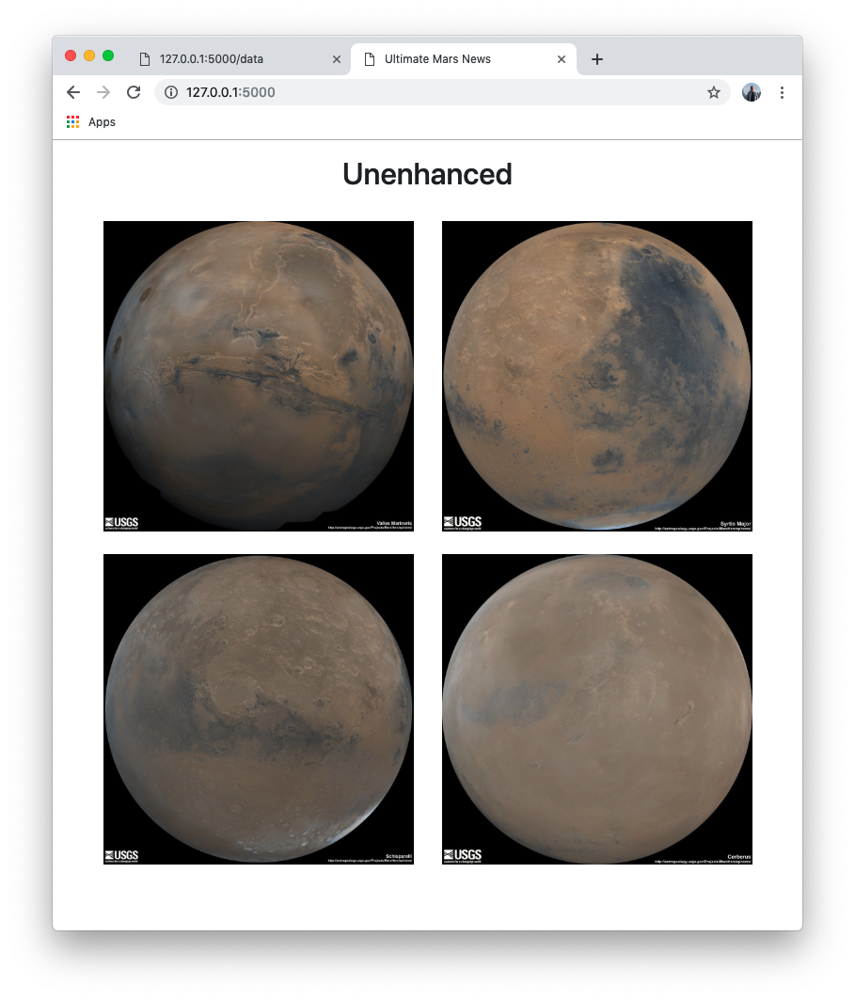

# scraping-NASA-website

## API endpoints

- **Home:** host/
- **Scraping:** host/scrape
- **Get JSON data:** host/data

## Screenshots

### Home

### Data

---

## Scraping

Jupyter Notebook, BeautifulSoup, Pandas, and Requests/Splinter.

### NASA Mars News
[NASA Mars News Site](https://mars.nasa.gov/news/) 

### JPL Mars Space Images - Featured Image
[JPL Featured Space Image](https://www.jpl.nasa.gov/spaceimages/?search=&category=Mars).

### Mars Weather
[Mars Weather twitter account](https://twitter.com/marswxreport?lang=en) 

### Mars Facts
[Mars Facts webpage](http://space-facts.com/mars/)

### Mars Hemispheres
[USGS Astrogeology site](https://astrogeology.usgs.gov/search/results?q=hemisphere+enhanced&k1=target&v1=Mars) 

- - -

## Step 2 - MongoDB and Flask Application

MongoDB with Flask == HTML

- - -

## Step 3 - Submission

Create a website w/ Bootstrap
